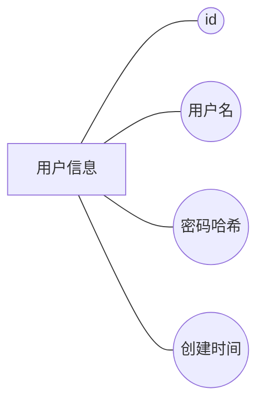
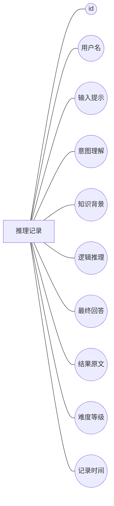
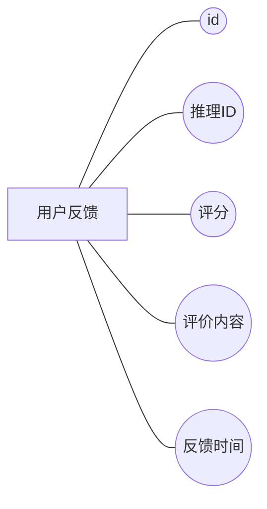
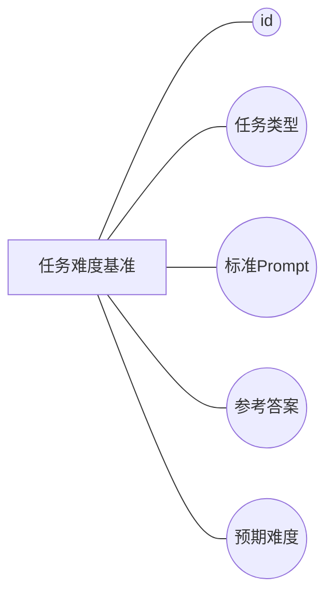
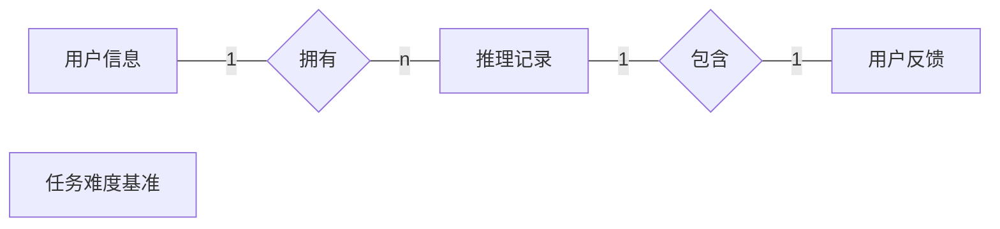

# 数据库设计文档：基于 Qwen2.5-Omni 的语音理解平台

本文档详细描述了“基于 Qwen2.5-Omni 深度思考的语音理解平台”的数据库设计。系统采用关系型数据库（MySQL），主要包括用户信息管理和语音推理记录管理两大核心模块。

---

## 1. 数据库实体-属性图 (Entity-Attribute Diagrams)

本节按照学术论文标准样式展示各个实体的属性构成。图中矩形代表实体，椭圆形代表属性。

### 1.1 用户实体 (User Entity)



### 1.2 推理记录实体 (Inference Record Entity)



### 1.3 用户反馈实体 (User Feedback Entity)



### 1.4 任务难度基准实体 (Task Benchmark Entity)



---

## 2. 全局实体关系图 (Global ER Diagram)

系统目前包含四个主要实体：`User`、`InferenceRecord`、`UserFeedback` 和 `TaskBenchmark`。图中矩形代表实体，菱形代表关系。



---

## 3. 数据库表结构说明 (Table Structures)

以下是按照 `DESCRIBE` 格式整理的数据库表结构定义。

### 3.1 用户表 (`users`)

| Field | Type | Key | Extra | Comment |
| :--- | :--- | :--- | :--- | :--- |
| `id` | `BIGINT` | `PRI` | `auto_increment` | 用户唯一标识符 |
| `username` | `VARCHAR(64)` | `UNI` | | 登录用户名 |
| `password_hash` | `VARCHAR(128)` | | | 经过哈希处理的加密密码 |
| `created_at` | `DATETIME` | | | 账号注册/创建时间 |

### 3.2 推理记录表 (`inference_records`)

| Field | Type | Key | Extra | Comment |
| :--- | :--- | :--- | :--- | :--- |
| `id` | `BIGINT` | `PRI` | `auto_increment` | 记录唯一标识符 |
| `username` | `VARCHAR(64)` | `MUL` | | 提交该推理请求的用户名 |
| `prompt` | `TEXT` | | | 用户输入的原始文本或语音转写内容 |
| `intent` | `TEXT` | | | 模型分析出的用户意图 |
| `knowledge` | `TEXT` | | | 模型检索到的相关知识或背景信息 |
| `deduction` | `TEXT` | | | 模型进行“深度思考”的逻辑推导过程 |
| `answer` | `TEXT` | | | 模型给出的最终结构化回答 |
| `result_text` | `TEXT` | | | 模型返回的完整响应内容 |
| `difficulty` | `INTEGER` | | | 模型对该问题的难度评分 (1-5) |
| `created_at` | `DATETIME` | | | 推理任务完成并记录的时间 |

### 3.3 用户反馈表 (`user_feedback`)

| Field | Type | Key | Extra | Comment |
| :--- | :--- | :--- | :--- | :--- |
| `id` | `BIGINT` | `PRI` | `auto_increment` | 反馈唯一标识符 |
| `record_id` | `BIGINT` | `MUL` | | 关联的推理记录 ID |
| `rating` | `INTEGER` | | | 用户评分 (1:踩 / 5:赞) |
| `comment` | `TEXT` | | | 用户填写的具体评价内容 |
| `created_at` | `DATETIME` | | | 反馈提交时间 |

### 3.4 任务难度基准表 (`task_benchmarks`)

| Field | Type | Key | Extra | Comment |
| :--- | :--- | :--- | :--- | :--- |
| `id` | `BIGINT` | `PRI` | `auto_increment` | 基准唯一标识符 |
| `task_type` | `VARCHAR(64)` | | | 任务所属领域 (如数学、逻辑、常识) |
| `prompt` | `TEXT` | | | 用于评测的标准输入提示词 |
| `reference_answer` | `TEXT` | | | 该提示词对应的专家参考答案 |
| `expected_difficulty` | `INTEGER` | | | 预设的难度系数 (1-100) |

---

## 4. SQL 实现 (MySQL 兼容)

```sql
-- 创建用户表
CREATE TABLE IF NOT EXISTS users (
  id BIGINT PRIMARY KEY AUTO_INCREMENT,
  username VARCHAR(64) NOT NULL UNIQUE,
  password_hash VARCHAR(128) NOT NULL,
  created_at DATETIME NOT NULL
);

-- 创建推理记录表
CREATE TABLE IF NOT EXISTS inference_records (
  id BIGINT PRIMARY KEY AUTO_INCREMENT,
  username VARCHAR(64) NOT NULL,
  prompt TEXT,
  intent TEXT,
  knowledge TEXT,
  deduction TEXT,
  answer TEXT,
  result_text TEXT,
  difficulty INTEGER,
  created_at DATETIME NOT NULL,
  INDEX idx_username (username)
);

-- 创建用户反馈表
CREATE TABLE IF NOT EXISTS user_feedback (
  id BIGINT PRIMARY KEY AUTO_INCREMENT,
  record_id BIGINT NOT NULL,
  rating INTEGER NOT NULL,
  comment TEXT,
  created_at DATETIME NOT NULL,
  INDEX idx_record (record_id)
);

-- 创建任务难度基准表
CREATE TABLE IF NOT EXISTS task_benchmarks (
  id BIGINT PRIMARY KEY AUTO_INCREMENT,
  task_type VARCHAR(64),
  prompt TEXT NOT NULL,
  reference_answer TEXT,
  expected_difficulty INTEGER
);

-- 插入 MMAU 评测基准示例数据
INSERT INTO task_benchmarks (task_type, prompt, reference_answer, expected_difficulty) VALUES 
('logic', '如果所有的 A 都是 B，所有的 B 都是 C，那么 A 是 C 吗？', '是', 20),
('math', '计算积分 sin(x) 从 0 到 PI 的值。', '2', 85);
```
